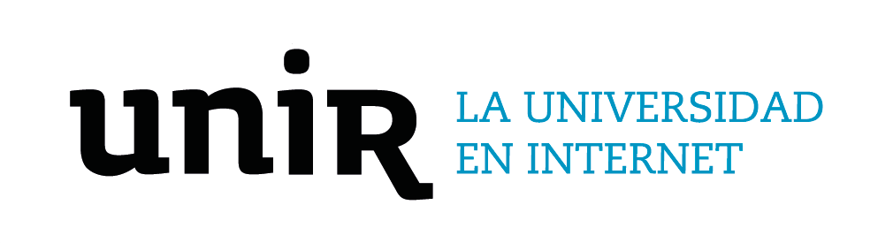
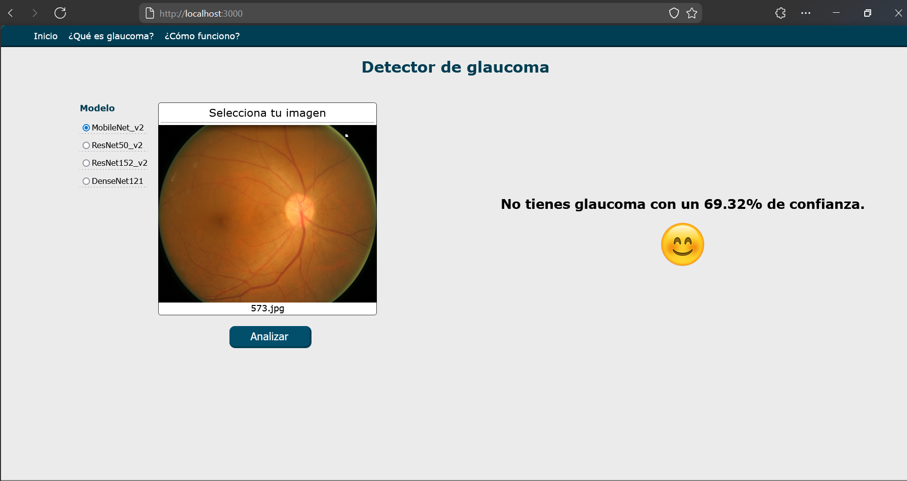
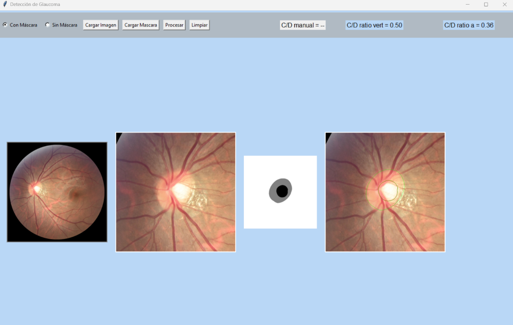

## Detector de glaucoma

<p align="center" width="500">
  
</p>

### Máster Universitario en Inteligencia Artificial
## Redes Neuronales convolucionales aplicadas en la Detección del Glaucoma

<b>Ruben Eduardo Acosta Vela</b>
<b>Harold Delgado</b>

<hr />

<p>En este repositorio se encuentra el código creado para el Máster Universitario en Inteligencia Artificial en la Universidad Internacional de La Rioja, donde se llevó a cabo el proyecto de detección del glaucoma mediante redes neuronales convolucionales.</p>

## Descripción del proyecto

Este proyecto tiene tres componentes:

1. Una aplicación web (carpetas front y back) que permite analizar una imagen elegiendo una de los cuatro modelos disponibles.

<p align="center" width="600">
  
</p>

2. Los notebooks de jupyter usados para organizar las imagenes, crear y entrenar los modelos, y realizar las predicciones.

3. Una aplicacion de escritorio (carpeta ROY) creada con tkinter que permite analizar la seccion del disco óptico y calcular la relacion de radios para el glaucoma.

<p align="center" width="600">
  
</p>

## Requerimientos

Para ejecutar el proyecto se necesitan los siguientes paquetes:

- Python 3.8
- Tensorflow 2.13.0
- Keras
- Tkinter
- Numpy
- FastApi
- Uvicorn
- Pillow
- Matplotlib
- Pandas
- Python-multipart
- Node.js 18.x

## Como ejecutar el proyecto

Para ejecutar la aplicacion web se debe seguir los siguientes pasos:

1. Descargar los modelos desde este [link](https://drive.google.com/file/d/1jGoxhDwQlhFcM_fkM7tiitSDP2NTrIV7/view?usp=sharing), descomprimirlos y guardarlos en la carpeta `models`.
2. Para ejecutar el servidor de la aplicacion web se debe correr el siguiente comando en la carpeta `back`:

```bash
python main.py
```

Esto carga los modelos en memoria y se inicia el servidor de la aplicacion web en el puerto 4000.

3. Para ejecutar el cliente se debe correr el siguiente comando en la carpeta `front`:

```bash
npm start
```

Esto inicia el cliente en el puerto 3000.

4. Para ejecutar los notebooks es necesario descargar los datos de entrenamiento desde este [link](https://drive.google.com/file/d/1tYE8o6JiAvw-fOihrO6mHw3uA-4E2Ktu/view?usp=sharing) y guardarlos en la carpeta `data`, dentro de la carpeta `notebooks`.